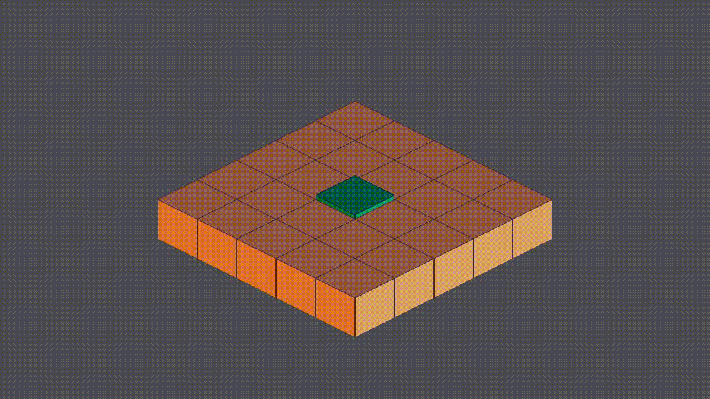

This is an example of working with nodes along-side a tilemap in Godot 4,
ensuring that the nodes render correctly.

The key trick is to wrap what you want to display in something that defines your
Y sort; after that you can do any sort of position manipulation you want.

## GIFs

## License

This is free and unencumbered software released into the public domain. Go make
something great.
